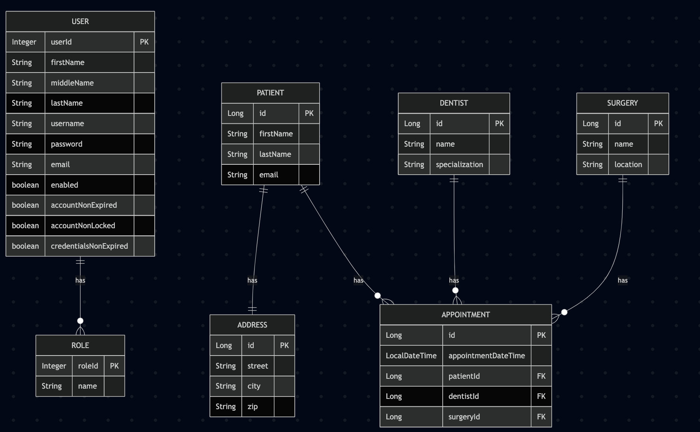

# 📄 Dental Clinic Management System

## 1. Project Description

This is a comprehensive Dental Clinic Management System designed to streamline the operations of a dental practice. The system provides a robust platform for managing appointments, patients, dentists, and surgeries while ensuring secure access through role-based authentication.

---

## 2. Problem Statement

Managing a dental clinic involves handling multiple complex operations including:
- Patient records and history management
- Appointment scheduling and tracking
- Dentist availability and specialization tracking
- Surgery room allocation
- Secure access control for different user roles
- Efficient data management and retrieval

Traditional paper-based or basic digital systems often lead to:
- Inefficient appointment scheduling
- Difficulty in tracking patient history
- Challenges in managing dentist schedules
- Security concerns with sensitive patient data
- Lack of real-time updates and notifications

This system addresses these challenges by providing a comprehensive digital solution.

---

## 3. Tech Stack

- **Backend Framework**: Spring Boot
- **Security**: Spring Security with JWT Authentication
- **Database**: JPA/Hibernate with MySQL
- **API Documentation**: Swagger/OpenAPI
- **Object Mapping**: MapStruct
- **Validation**: Jakarta Validation
- **Testing**: JUnit, Mockito
- **Build Tool**: Maven
- **IDE**: IntelliJ IDEA
- **Containerization**: Docker
- **Deployment**: AWS EC2 with CI/CD Pipeline (GitHub Actions)

---

## 4. Features

- User Authentication and Authorization
- Role-based Access Control (Admin, Dentist, Patient)
- Patient Management
- Dentist Management
- Appointment Scheduling
- Surgery Room Management
- RESTful API Endpoints
- Swagger API Documentation
- Exception Handling
- Data Validation
- Pagination and Sorting Support
- Dockerization for easy deployment
- CI/CD Pipeline using GitHub Actions
- Cloud Deployment (AWS EC2)

---

## 5. User Stories

1. As an admin, I want to manage all users and their roles.
2. As a dentist, I want to view and manage my appointments.
3. As a patient, I want to book and manage my appointments.
4. As a system user, I want to receive proper error messages.
5. As a user, I want to view paginated lists of data.
6. As a system, I want to validate all incoming data.
7. As a developer, I want to test all components.
8. As a system, I want to be deployed in the cloud with automated pipelines.

---

## 6. Domain Modeling



---

## 7. Tech Stack Explanation

### Backend
- **Spring Boot**: Rapid application development framework
- **Spring Security**: Authentication and authorization
- **JPA/Hibernate**: Object-relational mapping
- **MySQL**: Relational database
- **MapStruct**: Object mapping
- **Lombok**: Boilerplate code reduction
- **Swagger**: API documentation
- **JUnit/Mockito**: Testing framework

---

## 8. Architecture Design

### Layers
1. **Controller Layer**: REST endpoints, request validation
2. **Service Layer**: Business logic, transaction management
3. **Repository Layer**: Data access, JPA operations
4. **Model Layer**: Entities, DTOs, Mappers

### Design Patterns
- Repository Pattern
- Service Layer Pattern
- DTO Pattern
- Factory Pattern
- Strategy Pattern

---

## 9. DTO Usage & Validation

### DTOs

```java
public class PatientDTO {
    private Long id;
    private String name;
    private String email;
    private String phone;
    private String address;
}
```

```java
public class DentistDTO {
    private Long id;
    private String name;
    private String email;
}
```

```java
public class AppointmentDTO {
    private Long id;
    private String date;
    private String time;
}
```

```java
public class SurgeryRoomDTO {
    private Long id;
    private String name;
    private String location;
}
```

### Validation Example

```java
@NotNull(message = "Name is required")
@Size(min = 2, max = 50, message = "Name must be between 2 and 50 characters")
private String name;
```

---

## 10. Data Persistence

### Repository Example

```java
@Repository
public interface PatientRepository extends JpaRepository<Patient, Long> {
    Page<Patient> findByLastNameContaining(String lastName, Pageable pageable);
}
```

---

## 11. RESTful API Design

### Authentication
- `POST /api/auth/login` - User login
- `POST /api/auth/register` - User registration

### Patient Management
- `GET /api/patients`
- `POST /api/patients`
- `GET /api/patients/{id}`
- `PUT /api/patients/{id}`
- `DELETE /api/patients/{id}`
- `GET /api/patients/{id}/appointments`
- `GET /api/patients/search?name={name}`

### Dentist Management
- `GET /api/dentists`
- `POST /api/dentists`
- `GET /api/dentists/{id}`
- `PUT /api/dentists/{id}`
- `DELETE /api/dentists/{id}`
- `GET /api/dentists/{id}/appointments`
- `GET /api/dentists/specialization/{specialization}`

### Surgery Management
- `GET /api/surgeries`
- `POST /api/surgeries`
- `GET /api/surgeries/{id}`
- `PUT /api/surgeries/{id}`
- `DELETE /api/surgeries/{id}`
- `GET /api/surgeries/{id}/appointments`

### Appointment Management
- `GET /api/appointments`
- `POST /api/appointments`
- `GET /api/appointments/{id}`
- `PUT /api/appointments/{id}`
- `DELETE /api/appointments/{id}`
- `GET /api/appointments/patient/{patientId}`
- `GET /api/appointments/dentist/{dentistId}`
- `GET /api/appointments/surgery/{surgeryId}`
- `GET /api/appointments/date/{date}`
- `PUT /api/appointments/{id}/status`

### Address Management
- `GET /api/addresses/{id}`
- `PUT /api/addresses/{id}`
- `DELETE /api/addresses/{id}`

---

## 12. Global Exception Handling

```java
@RestControllerAdvice
public class GlobalExceptionHandler {
    @ExceptionHandler(ResourceNotFoundException.class)
    public ResponseEntity<ErrorResponse> handleResourceNotFound(ResourceNotFoundException ex) {
        // Exception handling logic
    }
}
```

---

## 13. Security Implementation

### JWT Configuration

```java
@Configuration
@EnableWebSecurity
public class SecurityConfig extends WebSecurityConfigurerAdapter {
    // Security configuration
}
```

### Role-based Access Example

```java
@PreAuthorize("hasRole('ADMIN')")
@GetMapping("/admin/users")
public ResponseEntity<List<UserDTO>> getAllUsers() {
    // Implementation
}
```

---

## 14. Software Testing

### Unit Tests

```java
@ExtendWith(MockitoExtension.class)
class PatientServiceTest {
    @Test
    void testCreatePatient() {
        // Test implementation
    }
}
```

### Integration Tests

```java
@SpringBootTest
@AutoConfigureMockMvc
class PatientControllerIntegrationTest {
    // Test implementation
}
```

---

## 15. Quick Deployment Guide

### 1. EC2 Setup
```bash
ssh -i /path/to/key.pem ec2-user@your-ec2-public-ip
sudo yum update -y
sudo amazon-linux-extras install java-openjdk17
sudo yum install docker -y
sudo service docker start
```

### 2. Docker Deployment
```bash
# Dockerfile
FROM openjdk:17-jdk-slim
WORKDIR /app
COPY FinalProject-0.0.1-SNAPSHOT.jar app.jar
EXPOSE 8080
ENTRYPOINT ["java", "-jar", "app.jar"]
```

```bash
# docker-compose.yml
version: '3.8'
services:
  app:
    build: .
    ports: ["8080:8080"]
    environment:
      - SPRING_DATASOURCE_URL=jdbc:mysql://mysql:3306/dental_clinic
      - SPRING_DATASOURCE_USERNAME=root
      - SPRING_DATASOURCE_PASSWORD=password
    depends_on: [mysql]
  mysql:
    image: mysql:8.0
    environment:
      - MYSQL_ROOT_PASSWORD=password
      - MYSQL_DATABASE=dental_clinic
```

```bash
# Run
docker-compose up -d
```

### 3. Alternative Deployment
```bash
java -jar FinalProject-0.0.1-SNAPSHOT.jar
```

---


